+++
date = '2026-05-13T00:00:00-03:00'
title = '¿Qué es una computadora?'
+++

## ¿Qué es una computadora?

### Ejemplos de que ES una computadora

Las siguientes imagenes muestran objetos **electrónicos** que **SON** computadoras:

	<figure>
		
		<figcaption>Celular</figcaption>
	</figure>
	<figure>
		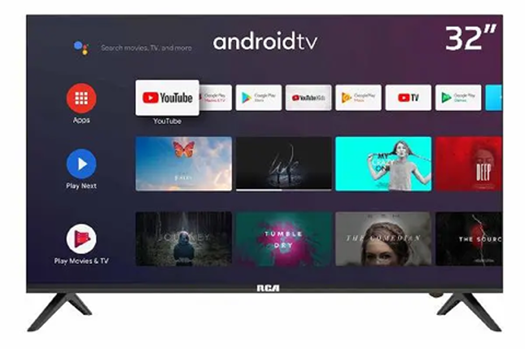
		<figcaption>Smart TV</figcaption>
	</figure>
	<figure>
		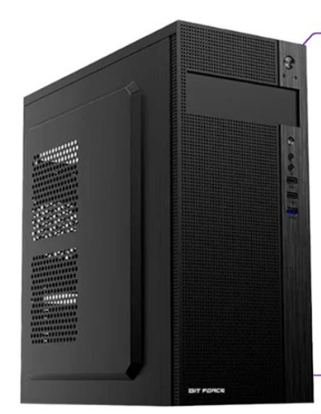
		<figcaption>PC de escritorio</figcaption>
	</figure>
	<figure>
		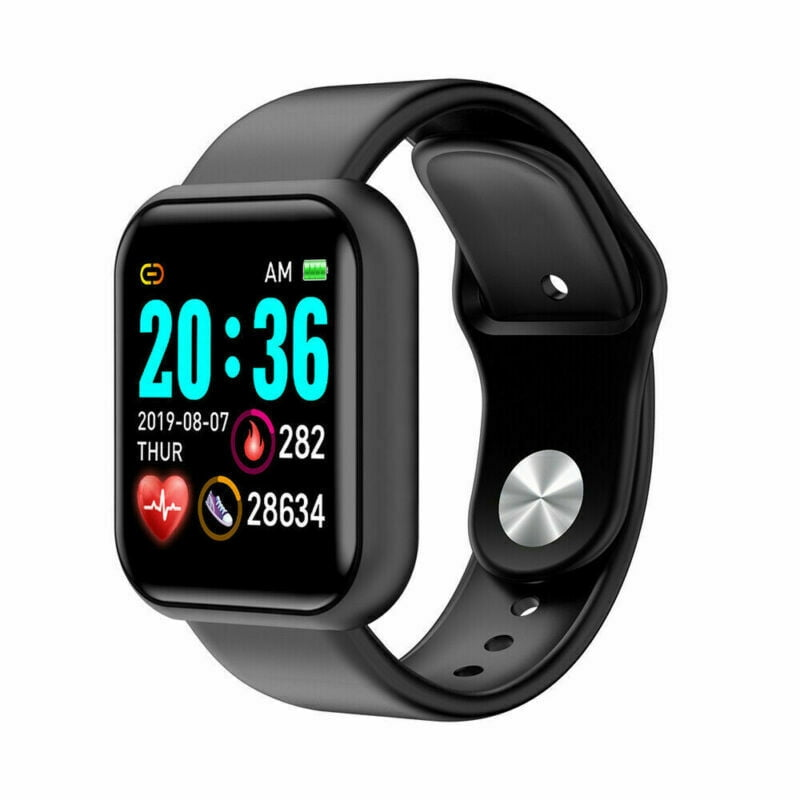
		<figcaption>Smartwatch</figcaption>
	</figure>
	<figure>
		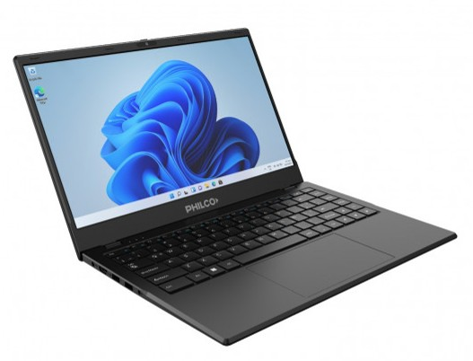
		<figcaption>Notebook</figcaption>
	</figure>
	<figure>
		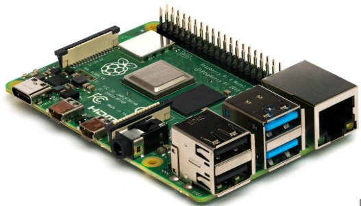
		<figcaption>Raspberry Pi</figcaption>
	</figure>

### Ejemplos de que NO ES una computadora

Las siguientes imagenes muestran objetos **electrónicos** que **NO SON** computadoras:

	<figure>
		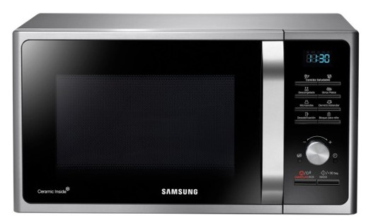
		<figcaption>Microondas</figcaption>
	</figure>
	<figure>
		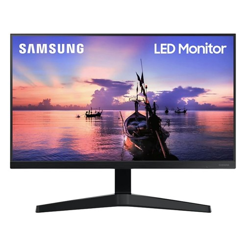
		<figcaption>Monitor</figcaption>
	</figure>
	<figure>
		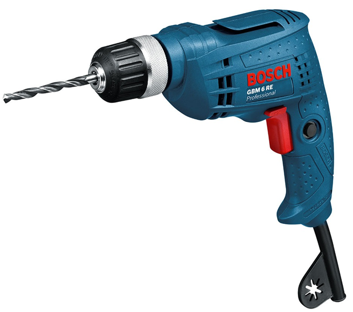
		<figcaption>Taladro</figcaption>
	</figure>
	<figure>
		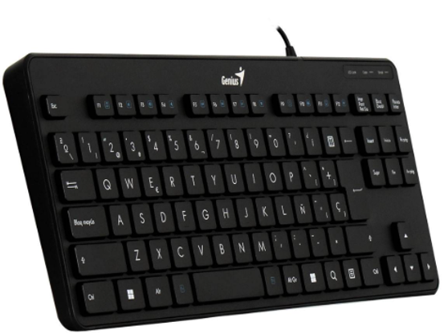
		<figcaption>Teclado</figcaption>
	</figure>
	<figure>
		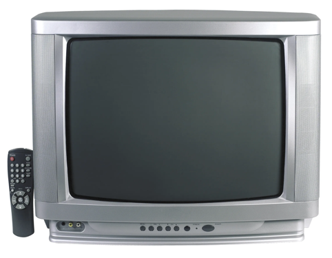
		<figcaption>Televisor</figcaption>
	</figure>
	<figure>
		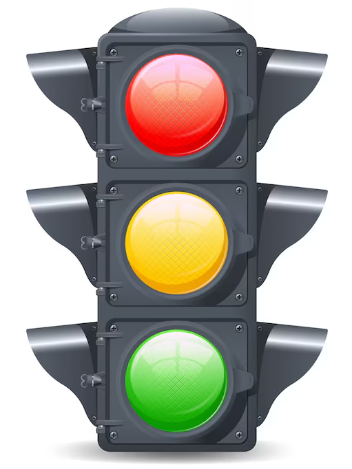
		<figcaption>Semafóro</figcaption>
	</figure>

## Definición

Una computadora es un dispositivo electrónico capaz de:
1. Recibir datos.
2. Procesar datos.
3. Almacenar datos.
4. Enviar datos

## Tarea

1. Escribir una lista de 3 objetos **electrónicos** que SEAN computadoras.

    - Tablet.
    - Netbook.
    - All-in-one.

2. Escribir una lista de 3 objetos **electrónicos** que NO SEAN computadoras.

    - Licuadora.
    - Tostadora.
    - Horno eléctrico.

3. Dibujar una red conceptual con estos 6 objetos.
  

	<figure>
		
	</figure>

4. Armar una tabla con los 6 objetos.

<table border="1">
  <thead>
    <th>EJEMPLOS</th>
    <th>NO EJEMPLOS</th>
  </thead>
  <tbody>
    <tr>
      <td>Tablet</td>
      <td>Licuadora</td>
    </tr>
    <tr>
      <td>Netbook</td>
      <td>Tostadora</td>
    </tr>
    <tr>
      <td>All-in-one</td>
      <td>Horno eléctrico</td>
    </tr>
  </tbody>
</table>

 

  

