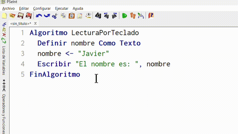

+++
date = '2025-08-10T23:38:02-03:00'
draft = false
title = 'Programa'
+++

<style>
th, td {
  text-align: center;
}
</style>

# Algoritmo. Parte 2. Programa

## Programa

**Definición**: Un programa es la implementación de un algoritmo en un lenguaje de programación listo para su ejecución.

Mientras que **un algoritmo es una idea abstracta** de una secuencia de pasos ordenada que puede ser escrito (implementado) en un diagrama de flujo, pseudocódigo o código fuente, **solo se llama programa a un algoritmo escrito en código fuente** o en **un pseudocódigo lo suficientemente bien definido** como para que una computadora lo ejecute.

## Elementos básicos de un programa

El ser humano **razona** a partir de los datos que recibe del exterior, los cuales se **almacenan** en su **cerebro**. De forma similar, la computadora **procesa** datos provenientes del exterior, que se **guardan** en su **memoria principal**, conocida como **R.A.M.** (Memoria de Acceso Aleatorio).  La R.A.M. está formada por numerosas posiciones o celdas, numeradas de manera consecutiva, capaces de almacenar información. 

Tanto el ser humano como la computadora, además de recibir y almacenar datos, pueden **interactuar** con otras personas o con otros sistemas informáticos.

A continuación exploraremos cómo una computadora **recibe** y **almacena** datos del exterior, así como las formas en que **interactúa** a través de mensajes simples.

### Cómo almacena. Variables

**Definición**: Una variable es una posición de memoria que almacena un valor (o dato).

Antes de ver como recibir datos tenemos que tener algún deposito en donde guardarlos.
En un programa hay datos que van cambiando durante el desarrollo del mismo. Para representar y manejar estos datos se usan las **VARIABLES**.

Las **variables** ocupan posiciones de memoria y **contienen valores**. Estas se identifican por un **nombre** y un **tipo de dato**.

- El **nombre** brinda un acceso familiar y reconocible para acceder al valor de la variable.
- El **tipo de dato** indica que valores puede contener y qué operaciones se pueden realizar con la variable.

### Nombre de una variable

**Definición**: Es un identificador que permite referenciar una variable.

#### Características del nombre de una variable

- El nombre de una variable tiene que ser *significativo*.
	- Ejemplos: `suma`, `nombre3`, `esAlto`.
	- No ejemplos: `s`, `d2`, `l2ix`.
- No pueden haber nombres repetidos en un mismo programa.
- No se pueden usar palabras reservadas por el lenguaje de programación.
- El primer carácter debe ser una **letra** o un guión bajo (`_`).
- Los siguientes caracteres pueden ser letras minúsculas, letras mayúsculas y/o números.
- No puede contener espacios, caracteres especiales, signos de puntuación o letras acentuadas.
  - Espacios: `space`, `enter`, `tab`, etc.
  - Caracteres especiales: `%`, `$`, `&`, `@`, `.`, etc.
  - Signos de puntuación: `.`, `;`, `,`, etc.
  - Letras acentuadas: `ñ`, `ú`, `ö`, `Å`, etc.

<table border="1">
			<thead>
    <tr>
        <th>Nombres válidos</th>
        <th>Nombres inválidos</th>
    </tr>
			</thead>
				<tbody>
					<tr>
									<td><code>numero1</code></td>
									<td><code>número</code></td>
					</tr>
					<tr>
									<td><code>descuento</code></td>
									<td><code>20descuento</code></td>
					</tr>
					<tr>
									<td><code>totalDeRecargo2</code></td>
									<td><code>total de recargo 2</code></td>
					</tr>
					<tr>
									<td><code>sumaSalarios</code></td>
									<td><code>suma$</code></td>
					</tr>
					<tr>
									<td><code>seis</code></td>
									<td><code>algoritmo</code></td>
					</tr>
				</tbody>
</table>

### Tipo de dato

**Definición:** El tipo de dato es un indicador que determina los **valores** que puede guardar una variable y las **operaciones** que se pueden realizarse con ella.

Un dato o valor puede ser un número entero como el `34`, una palabra o varias palabras como `"Hola mundo"` o valores lógicos (booleanos) como `verdadero` y `falso`.
Estos son los tres tipos de datos que usaremos:

<table border="1">
    <thead>
        <tr>
            <th>Tipo de dato</th>
            <th>Ejemplos de valores</th>
            <th>Operaciones</th>
        </tr>
    </thead>
    <tbody>
        <tr>
            <td>Numérico</td>
            <td><code>-10</code>, <code>0</code>, <code>35</code></td>
            <td>Suma, resta, multiplicación, división, etc.</td>
        </tr>
        <tr>
            <td>Texto</td>
            <td><code>"Permite espacios"</code><br><code>"2 ñandúes"</code></td>
            <td>Concatenación.</td>
        </tr>
        <tr>
            <td>Lógico</td>
            <td><code>verdadero<code/><br><code>falso<code/></td>
            <td>Negación, conjunción y disyunción.</td>
        </tr>
    </tbody>
</table>

#### Ejercitación

Indicar cuales de los siguientes nombres de variables son **válidos** y **significativos**:

<table border="1">
    <tr>
        <td><code>s2k</code></td>
        <td><code>$total</code></td>
    </tr>
    <tr>
        <td><code>descuento</code></td>
        <td><code>cantidadDeNiños</code></td>
    </tr>
    <tr>
        <td><code>nombreMoneda</code></td>
        <td><code>litrosAgua</code></td>
    </tr>
    <tr>
        <td><code>inc</code></td>
        <td><code>FinAlgoritmo</code></td>
    </tr>
    <tr>
        <td><code>metros</code></td>
        <td><code>altura2e</code></td>
    </tr>
</table>

#### Etapas de una variable

Una variable pasa por distintas etapas: Definición (o declaración), inicialización, asignación y obtención del valor.

##### Definición

En esta etapa se crea la variable con algún nombre y se indica de qué tipo de dato es.

Ejemplo de cómo definir una variable llamada `apellido` como tipo `Texto` en PSeInt:

```
1 Algoritmo Definicion
2   Definir apellido Como Texto
3 FinAlgoritmo
```

Ejemplo de cómo definir una variable llamada `edad` como tipo `Numerico` en PSeInt:

```
1 Algoritmo Definicion
2   Definir edad Como Numerico
3 FinAlgoritmo
```

Ejemplo de cómo definir una variable llamada `esMayorDeEdad` como tipo `Logico` en PSeInt:

```
1 Algoritmo Definicion
2   Definir esMayorDeEdad Como Logico
3 FinAlgoritmo
```

En muchos lenguajes de programación, incluido PSeInt, **no se permite definir dos variables con el mismo nombre**. El siguiente código en PSeInt muestra un error en la línea 3 indicando esto mismo.

```
1 Algoritmo Definicion
2   Definir numeroDocumento como Numerico
3   Definir numeroDocumento como Texto
4 FinAlgoritmo
```

#### Inicialización

Esta etapa se denomina así porque es cuando la variable obtiene su valor inicial o primer valor, siempre dependiendo de su tipo de dato previamente asignado. Si bien algunos lenguajes de programación 

Ejemplo de cómo inicializar una variable llamada `apellido` de tipo `Texto` en PSeInt:

```
1 Algoritmo Inicializacion
2   Definir apellido Como Texto
3   apellido <- "Gonzaléz"
4 FinAlgoritmo
```

Ejemplo de cómo inicializar una variable llamada `edad` como tipo `Numerico` en PSeInt:

```
1 Algoritmo Inicializacion
2   Definir edad Como Numerico
3   edad <- 12
4 FinAlgoritmo
```

Ejemplo de cómo inicializar una variable llamada `esMayorDeEdad` como tipo `Logico` en PSeInt:

```
1 Algoritmo Inicializacion
2   Definir esMayorDeEdad Como Logico
3   esMayorDeEdad <- Verdadero
4 FinAlgoritmo
```

Como se observa en los tres ejemplos hechos en PSeInt, antes de inicializar una variable es necesario definir su tipo de dato. Para inicializarla, se debe escribir en una sola línea: primero el nombre de la variable, luego los caracteres `<-` y finalmente un valor.

#### Asignación

Aunque la asignación se escribe de la misma manera que la inicialización, se diferencia en que no siempre corresponde al primer valor de la variable, sino que puede implicar la modificación de su contenido. Esta operación puede considerarse _destructiva_, ya que, en principio, una vez realizada el valor anterior no puede recuperarse dentro de la misma variable.

Ejemplo de cómo asignar en la línea 4 un nuevo valor `Texto` en PSeInt:

```
1 Algoritmo Asignacion
2   Definir apellido Como Texto
3   apellido <- "González"
4   apellido <- "Méndez"
5 FinAlgoritmo
```

Ejemplo de cómo asignar en la línea 4 un nuevo valor `Numerico` en PSeInt:

```
1 Algoritmo Asignacion
2   Definir edad Como Numerico
3   edad <- 12
4   edad <- 0
5 FinAlgoritmo
```

Ejemplo de cómo asignar en la línea 4 un nuevo valor `Logico` en PSeInt:

```
1 Algoritmo Asignacion
2   Definir esMayorDeEdad Como Logico
3   esMayorDeEdad <- Verdadero
4   esMayorDeEdad <- Falso
5 FinAlgoritmo
```

En estos ejemplos se puede ver que **la inicialización es solo un caso especial de asignación**. A la derecha de los caracteres `<-` pueden ir más *cosas* que solo valores, puede haber otra variable y operaciones, como se verá en la siguiente etapa.

#### Obtención del valor

Una variable se encuentra en la etapa de obtención de su valor cuando aparece a la derecha de la instrucción de asignación, es decir, a la derecha de los caracteres `<-` en PSeInt. En este caso, la variable no se utiliza para cambiar su contenido, sino para _proporcionar_ su valor a una operación u otra instrucción.

Ejemplo de cómo obtener el valor que guarda `apellido` para concatenar a la izquierda otro texto en la línea 5 en PSeInt:

```
1 Algoritmo Obtención
2   Definir apellido Como Texto
3   Definir nombreCompleto Como Texto
4   apellido <- "González"
5   nombreCompleto <- "Martín " + apellido
6 FinAlgoritmo
```

Ejemplo de cómo obtener el valor que guarda `edad` para restar en la línea 5 en PSeInt:

```
1 Algoritmo Obtención
2   Definir edad Como Numerico
3   Definir aniosFaltantes Como Numerico
4   edad <- 12
5   aniosFaltantes <- 18 - edad
6 FinAlgoritmo
```

Ejemplo de cómo obtener el valor que guarda `esMayorDeEdad` para negarlo en la línea 5 un nuevo valor `Logico` en PSeInt:

```
1 Algoritmo Obtención
2   Definir esMayorDeEdad Como Logico
3   Definir esMenorDeEdad Como Logico
4   esMayorDeEdad <- Verdadero
5   esMenorDeEdad <- no esMayorDeEdad
6 FinAlgoritmo
```

### Cómo interactuar. Lectura por teclado.

Para recibir datos de la persona que utilice nuestro programa (a la que llamaremos _usuario_), es necesario contar con una instrucción que le indique a la computadora que espere a que se escriba algo en el teclado y, al presionar la tecla `Enter`, lea lo ingresado y lo guarde en un lugar donde pueda ser utilizado.

En PSeInt se utiliza la instrucción `Leer` seguido del nombre de la variable que deseamos almacenar el dato recibido por el usuario. Ejemplo:

```
1 Algoritmo LecturaPorTeclado
2   Definir edad Como Numerico
3   Leer edad
4 FinAlgoritmo
```

Lo ingresado por el usuario debe coincidir con el tipo de dato definido para la variable en la que será almacenado, sino mostrará un error.
 


Esto ocurre principalmente con variables de tipo `Numerico`. En cambio, con variables de tipo `Texto` no sucede, ya que los caracteres numéricos se interpretan simplemente como texto.


Sin embargo, dependiendo del lenguaje de programación, intentar realizar operaciones numéricas puede producir errores o resultados inesperados.
 
Por ejemplo, el siguiente código en PSeInt no puede ejecutarse porque (en la línea 5) el carácter `+` puede interpretarse tanto como una suma como una concatenación. Ante esta ambigüedad, al combinar el valor `10` (de tipo `Numerico`) con la variable `edad` (de tipo `Texto`), el programa impide su ejecución.

```
1 Algoritmo LecturaPorTecladoConError
2   Definir edad Como Texto
3   Definir aumento Como Texto
4   Leer edad
5   aumento <- edad + 10
6 FinAlgoritmo
```

### Cómo mostrar. Escritura en pantalla.

Hasta el momento solo se han guardado datos predefinidos por nosotros o leídos por el usuario. Para mostrar los resultados de nuestro algoritmo en la pantalla de la computadora se debe utilizar una instrucción especifica para eso. En PSeInt dicha instrucción es `Escribir`, que hace referencia a que la computadora escribirá en la terminal los valores que le indiquemos a la derecha de esta *palabra clave*.

Ejemplo simple de como usar `Escribir` en PSeInt

```
Algoritmo EscrituraEnPantalla
  Escribir "Hola mundo!"
FinAlgoritmo
```

Para mostrar el valor de una variable con un mensaje se puede usar la coma (`,`) como separador de parámetros.

```
Algoritmo EscrituraEnPantalla
  Definir nombre Como Texto
  nombre <- "Javier"
  Escribir "El nombre es: ", nombre
FinAlgoritmo
```



Esto también puede ser usado con otros tipos de datos que no sean necesariamente `Texto`, ya que la instrucción `Escribir` se encarga de convertirlos a texto por nosotros.


## Algunos ejemplos más

**Problema:** Implementar un algoritmo en PSeInt que lea dos números por teclado y escriba en pantalla la suma de dichos números

**Código en Pseint**:

```
1  Algoritmo Suma
2    Definir numero1 Como Numerico
3    Definir numero2 Como Numerico
4    Definir suma Como Numerico
5    Escribir "Ingrese el primer número: "
6    Leer numero1
7    Escribir "Ingrese el segundo número: "
8    Leer numero2
9    suma <- numero1 + numero2
10   Escribir "La suma es ", suma
11 FinAlgoritmo
```

**Problema:** Crear un código que pida al usuario su nombre, su apellido y su edad y muestre por pantalla los tres datos.

**Código en Pseint**:

```
1  Algoritmo PedirDatos
2    Definir nombre Como Texto
3    Definir apellido Como Texto
4    Definir edad Como Numerico
5    Escribir "Ingrese su nombre: "
6    Leer nombre
7    Escribir "Ingrese su apellido: "
8    Leer apellido
9    Escribir "Ingrese su edad: "
10   Leer edad
11   Escribir "Usted se llama ", nombre, " ", apellido, " y tiene ", edad, " años"
12 FinAlgoritmo
```

**Problema:** Diseñar un pseudocódigo para promediar dos notas de exámenes para luego imprimir dicho promedio.

**Código en Pseint**:

```
1  Algoritmo PromedioDeDosNotas
2    Definir nota1 Como Numerico
3    Definir nota2 Como Numerico
4    Definir promedio Como Numerico
5    Escribir "Ingrese primera nota: "
6    Leer nota1
7    Escribir "Ingrese segunda nota: "
8    Leer nota2
9    promedio <- (nota1 + nota2) / 2
10   Escribir "El promedio de notas es: ", promedio
11 FinAlgoritmo
```
